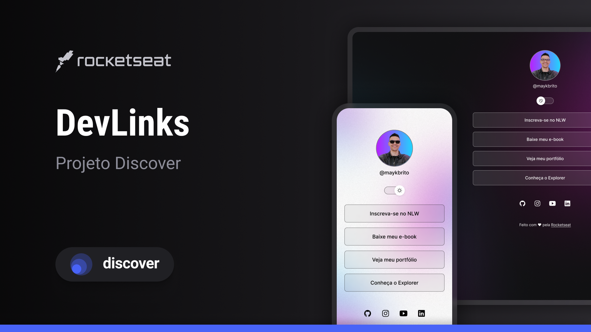

# Devlinks

Programa exclusivo e gratuito, promovido pela Rocketseat para ensino de tecnologias WEB.

[**Tecnologias**]

[**Projeto**](.vscode/assets/script.js)   |   [**Layout**](#-layout)   |   [**Licença**](#memo-licença)

  [Licença]

<!-- Badge centered visually, but Markdown doesn't support true centering -->

![License][license]

## 🚀 Tecnologias

Esse projeto foi desenvolvido com as seguintes tecnologias:

- HTML e CSS
- JavaScript
- Git e Github
- Figma

## 💻 MeuPrimeiroProjeto

O DevLinks é um agregador de links para usar como cartão de visitas Online.

## 🔖 Layout

Você pode visualizar o layout do projeto através [DESSE LINK](https://www.figma.com/design/eGNTBmJGKDNrf9ton0K8Qa/DevLinks-%E2%80%A2-Projeto-Discover--Community-?node-id=1437-191&t=nm9isYht3eJt17mH-1). É necessário ter conta no [Figma](https://figma.com) para acessá-lo.

## :memo: Licença

Esse projeto está sob a licença MIT.

---

Feito com ♥ by Rocketseat :wave: [Participe da nossa comunidade!](https://discord.gg/rocketseat)

[license]: https://img.shields.io/static/v1?label=license&message=MIT&color=49AA26&labelColor=000000
